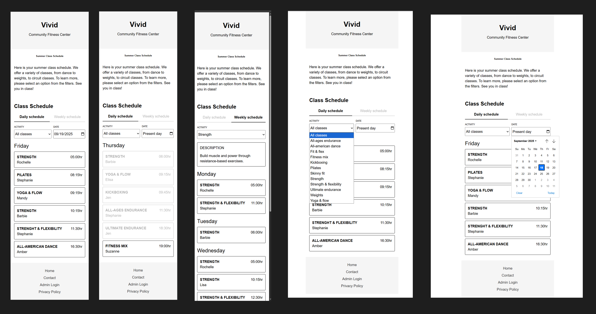
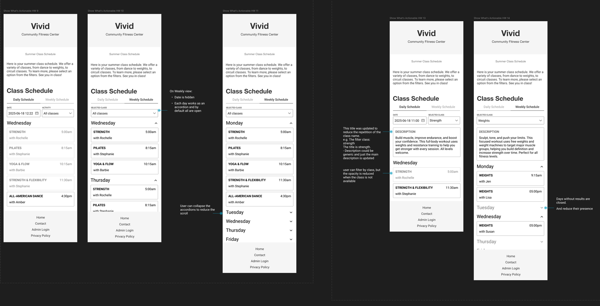

# Project title: Community fitness center
A full featured frontend project built with vanilla JS to practice and learn OOP in JS, observables (design pattern). 
- This is a fictional Summer class app that shows the schedules. 
- It has 2 views :
    - Daily schedule: This view shows the user the current day schedule, 
        - the classes are presented in cards; on initial load each card time is compared to the current hour, and cards for classes that have already passed the current hour are styled differently
        - Shows :
            - Activity `<select>`: Filters activities for the day based on the selected activity
            - Date `<input>`: It updates the list depending on the selected date.
                - Saturdays and Sundays don't have activities, they show empty card

    - Weekly Schedule : 
        - Displays a list with all the days that contains an activity
        - Date input is hidden in weekly views
        - Activity Select, help the user to filter by class; by default it shows all classes

- When selecting an activity from the select, a box shows with a brief description of that activity

## Motivation 
This project was inspired by a Figma concept and designed to study OOP in JS with classes and `this`
- The layout is inspired by a Figma concept but is not identical; it served as visual reference while practicing JS
- Showcase production-level thinking in a modular, maintainable codebase.

## Tech / tool used
- JavaScript (ES6+)
- Object Oriented Programming (OOP) with ES6 classes
- Observable pattern for event handling
- DOM manipulation and event handling
- HTML/CSS (mobile-first layout)

## Project Goals
1. Hands-on mastery of advanced JS
2. Demonstrate modular, maintainable, production-level code
3. Showcase problem-solving and interactive UI features

## Project structure
- `index.html` - main HTML entry
- `styles/` - CSS styles
- `js/`
    - `constants.js` - Project constants (IDs, activities list)
    - `utils.js` - helper functions
    - `observable.js` - Observable class for event subscription
    - `main.js` - Main entry point, wires all components
    - `Select.js`- Select base extends for Dropdown and Date components
    - `ToggleScheduleView.js` - Toggle daily/weekly schedule
    - `Footer.js` - Footer links
    - `DaySchedule/` - Contains all component related to rendering daily schedules
        - `ActivityDescription.js` - Activity Description rendering
        - `ActivityCard.js` - Single activity card rendering
        - `DayTitle.js` - Header for each day
        - `Schedule.js` - Schedule list component

## Screenshots

## Design Inspiration
Some UI concepts for this app were explored as part of a personal UI/UX study.
These exercises helped me understand user flows, layout, and interaction design, which I applied to the frontend implementation.
> Note: this project focuses on **JavaScript OOP, and modular architecture**, not visual design. The design references were used purely to practice creating usable interfaces in code.